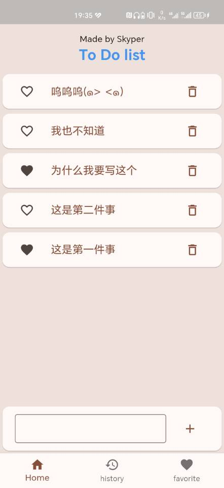
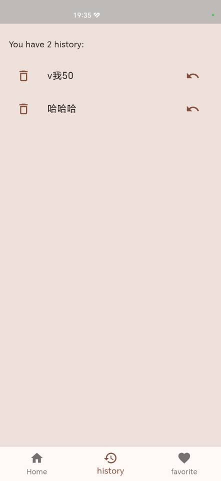
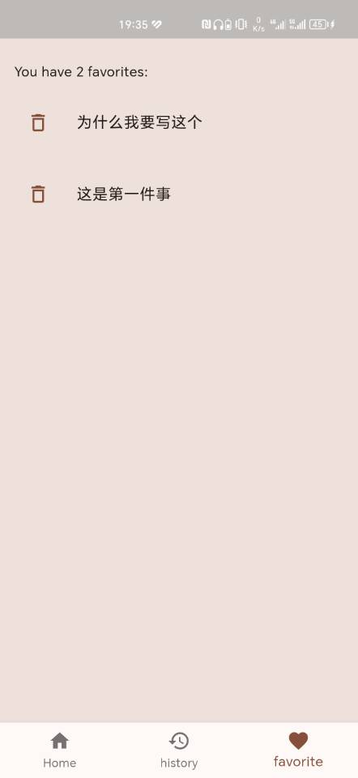

# my_memo

这是一个由flutter写的app，是一个todo list,具有一个todo list的基本功能

## 产品展示

  

(甚至作者做了横屏适配，他真的，我哭死)

## 使用说明
这么简单易懂的app还需要说明？

## 参考
flutter中文官网

## 待优化
- [x] 增加"支持作者"页面
- [ ] 界面美化
- [ ] 可伸缩长度的输入框
  
以下为异想天开的想法（
- [ ] 与日历联动
- [ ] 数据库存储数据
- [ ] 云端同步
